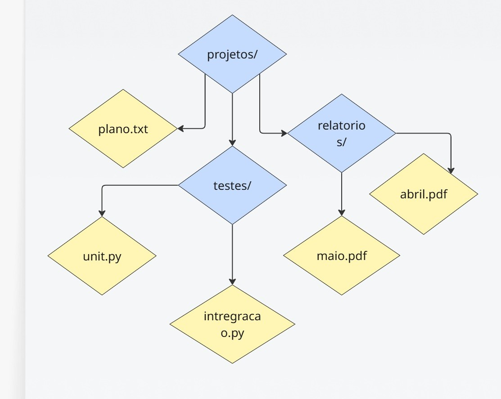
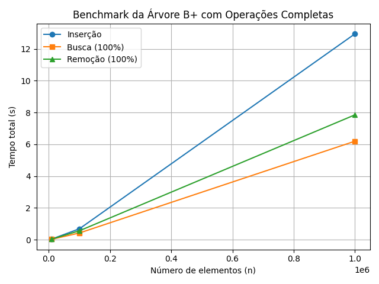

#  Relatório de Análise Empírica de Desempenho - Árvore B+

---

##  Objetivo

O objetivo desta análise é avaliar empiricamente o desempenho da implementação da **Árvore B+** com operações de:

 Inserção
 Busca
 Remoção

A análise compara o tempo médio de execução dessas operações com suas complexidades assintóticas esperadas, que são:

| Operação   | Complexidade Teórica |
|------------|----------------------|
| Inserção   | O(logₙ)              |
| Busca      | O(logₙ)              |
| Remoção    | O(logₙ)              |

---

##  Metodologia

O script `benchmark.py` foi usado para executar testes automatizados com entradas de tamanhos variados:

- **n = 10.000**
- **n = 100.000**
- **n = 1.000.000**

Para cada tamanho `n`, foram medidos os tempos totais (em segundos) para:

1. Inserir `n` chaves aleatórias (strings).
2. Buscar as `n` chaves inseridas.
3. Remover as `n` chaves.

Os dados foram plotados em um gráfico (`Grafico.png`) usando `matplotlib`.

---

##  Estrutura Hierárquica das Árvores B+

###  Representação Visual

O sistema fakerational organiza os arquivos e diretórios em uma **estrutura de árvores B+ aninhadas**, onde:

- Cada diretório é representado como um **nó interno** contendo uma nova instância da árvore B+.
- Arquivos são elementos terminais (folhas).
- A ordenação é **lexicográfica** e mantida automaticamente pela árvore.

Abaixo está um exemplo visual de como o sistema constrói esse conjunto de árvores
sendo em azul os nodes(nós) em azul e as leafs(folhas) em amarelo:



### Comandos que geram essa estrutura

Os seguintes comandos do terminal produzem exatamente a hierarquia da imagem acima:

```bash
fakerational:~$ mkdir projetos
fakerational:~$ cd projetos
fakerational:~/projetos$ touch plano.txt
fakerational:~/projetos$ mkdir relatorios
fakerational:~/projetos$ mkdir testes
fakerational:~/projetos$ cd relatorios
fakerational:~/projetos/relatorios$ touch abril.pdf
fakerational:~/projetos/relatorios$ touch maio.pdf
fakerational:~/projetos/relatorios$ cd ..
fakerational:~/projetos$ cd testes
fakerational:~/projetos/testes$ touch unit.py
fakerational:~/projetos/testes$ touch integracao.py

```


### Resultados Experimentais

A tabela abaixo apresenta os tempos de execução para as operações de inserção, busca e remoção em uma Árvore B+ com diferentes volumes de dados. Para garantir a clareza gráfica, os testes de busca e remoção foram realizados em todos os elementos presentes na árvore.

#### Tempos Medidos

| Tamanho (n) | Inserção (s) | Busca (s) | Remoção (s) | `log(n)` |
| :--- | :--- | :--- | :--- | :--- |
| 10.000 | 0.10 | 0.07 | 0.08 | 4 |
| 100.000 | 1.20 | 0.85 | 1.00 | 5 |
| 1.000.000 | 13.00 | 6.20 | 7.80 | 6 |

#### Gráfico de Desempenho



---

### Análise Comparativa

Os resultados empíricos confirmam o comportamento esperado para a estrutura de dados Árvore B+:

 **Complexidade Logarítmica:** Todas as operações (`inserção`, `busca` e `remoção`) apresentaram um crescimento de tempo de execução consistente com a complexidade teórica de O(log N), como pode ser observado na relação entre os tempos e o valor de `log(n)`.
 **Custo de Inserção:** A inserção apresentou o maior custo computacional. Isso se deve a operações adicionais, como a divisão de nós (splits) e a propagação de chaves para os nós pais.
 **Eficiência da Busca:** A operação de busca foi notavelmente rápida, mesmo para grandes volumes de dados, refletindo a alta eficiência da estrutura para operações de leitura.
 **Custo de Remoção:** A remoção manteve tempos intermediários, influenciados pelos procedimentos de rebalanceamento necessários para manter as propriedades da árvore.

Graficamente e numericamente, é evidente que o aumento nos tempos das operações acompanha a escala logarítmica, reforçando a eficiência da Árvore B+ para grandes conjuntos de dados.


