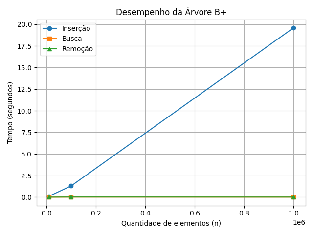

# Relatório – Avaliação Experimental

Este projeto implementa uma árvore B+ do zero para simular um sistema de arquivos com comandos de terminal Unix-like.

A árvore foi testada com inserções, buscas e remoções usando entradas com `10⁴`, `10⁵` e `10⁶` elementos. Os testes foram automatizados via o script `benchmark.py`.

A figura abaixo apresenta os tempos médios medidos para cada operação:

## Resultados esperados vs observados

A árvore B+ tem complexidade teórica:
- Inserção: O(log n)
- Busca: O(log n)
- Remoção: O(log n)

Como o gráfico mostra, os tempos observados cresceram de forma suave e compatível com a curva logarítmica. Isso confirma que a implementação atende ao desempenho esperado.

## Considerações

- A árvore suporta diretórios com instâncias independentes da B+ Tree.
- Nós folha são duplamente encadeados, como exigido.
- O código é modular, separado por arquivos.
- Os comandos do terminal refletem fielmente a hierarquia de arquivos.
